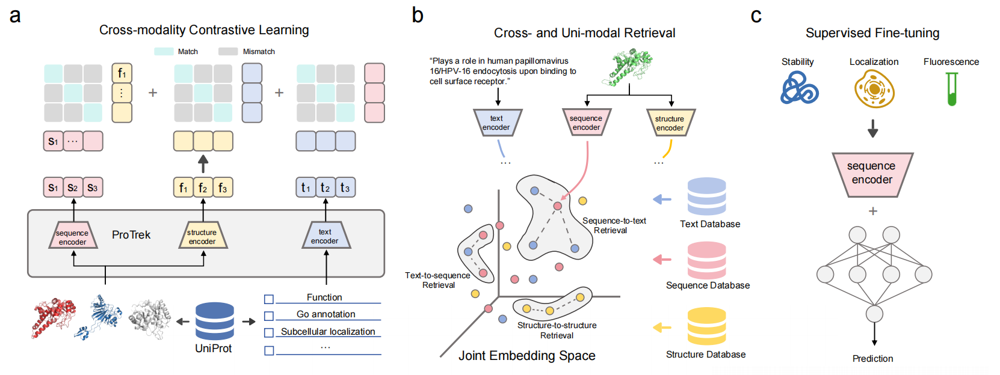

# ProTrek: Navigating the Protein Universe through Tri-Modal Contrastive Learning
<a href="https://doi.org/10.1101/2024.05.30.596740"></a>
<a href="http://search-protrek.com/"></a>
<a href="https://huggingface.co/westlake-repl/ProTrek_650M_UniRef50"></a>
<a href="https://cbirt.net/charting-the-protein-universe-with-protreks-tri-modal-contrastive-learning/" alt="blog"></a> 

The repository is an official implementation of [ProTrek: Navigating the Protein Universe through Tri-Modal Contrastive Learning](https://doi.org/10.1101/2024.05.30.596740).

Quickly try our online server [here](http://search-protrek.com/).

If you have any question about the paper or the code, feel free to raise an issue!

<details open><summary><b>Table of contents</b></summary>

- [News](#News)
- [Overview](#Overview)
- [Environment installation](#Environment-installation)
- [Download model weights](#Download-model-weights)
- [Download Foldseek binary file](#Download-Foldseek-binary-file)
- [Obtain embeddings and calculate similarity score](#Obtain-embeddings-and-calculate-similarity-score)
- [Deploy your demo locally](#Deploy-your-demo-locally)
</details>

## News
- **2024/09/27:** We added OMG database, which contains 200M protein sequences from metagenomic sequencing.
- **2024/09/04:** We built [ColabProTrek](https://colab.research.google.com/github/westlake-repl/SaprotHub/blob/main/colab/ColabProTrek.ipynb?hl=en).
ColabProTrek has joined [OPMC](https://theopmc.github.io/). If you find it useful for your research, please consider also cite the original OPMC [paper](https://doi.org/10.1101/2024.05.24.595648).

## Overview
ProTrek is a tri-modal protein language model that jointly models protein sequence, structure and function (SSF). It employs
contrastive learning with three core alignment strategies: (1) using structure as the supervision signal for AA
sequences and vice versa, (2) mutual supervision between sequences and functions, and (3) mutual supervision
between structures and functions. This tri-modal alignment training enables ProTrek to tightly associate SSF by
bringing genuine sample pairs (sequence-structure, sequence-function, and structure-function) closer together while
pushing negative samples farther apart in the latent space.

ProTrek achieves over 30x and 60x improvements in sequence-function and function-sequence retrieval, is 100x faster than Foldseek and MMseqs2 in protein-protein search, and outperforms ESM-2 in 9 of 11 downstream prediction tasks.



## Environment installation
### Create a virtual environment
```
conda create -n protrek python=3.10 --yes
conda activate protrek
```
### Clone the repo and install packages
```
bash environment.sh  
```

## Download model weights
ProTrek provides pre-trained models with different sizes (35M and 650M), as shown below. For each pre-trained model, 
Please download all files and put them in the `weights` directory, e.g. `weights/ProTrek_35M_UniRef50/...`.


| **Name**                                                     | **Size （protein sequence encoder）** | **Size （protein structure encoder）** | **Size （text encoder）** | Dataset               |
| ------------------------------------------------------------ | ------------------------------------- | -------------------------------------- |-------------------------| --------------------- |
| [ProTrek_35M_UniRef50](https://huggingface.co/westlake-repl/ProTrek_35M_UniRef50) | 35M parameters                        | 35M parameters                         | 130M parameters         | Swiss-Prot + UniRef50 |
| [ProTrek_650M_UniRef50](https://huggingface.co/westlake-repl/ProTrek_650M_UniRef50) | 650M parameters                       | 150M parameters                        | 130M parameters         | Swiss-Prot + UniRef50 |

We provide an example to download the pre-trained model weights.
```
huggingface-cli download westlake-repl/ProTrek_650M_UniRef50 \
                         --repo-type model \
                         --local-dir weights/ProTrek_650M_UniRef50
```
> Note: if you cannot access the huggingface website, you can try to connect to the mirror site through "export 
> HF_ENDPOINT=https://hf-mirror.com"

## Download Foldseek binary file
To run examples correctly and deploy your demo locally, please at first download the Foldseek
binary file from [here](https://drive.google.com/file/d/1B_9t3n_nlj8Y3Kpc_mMjtMdY0OPYa7Re/view?usp=sharing) and place 
it into the `bin` folder. Then add the execute permission to the binary file.
```
chmod +x bin/foldseek
```

## Obtain embeddings and calculate similarity score
Below is an example of how to obtain embeddings and calculate similarity score using the pre-trained ProTrek model.
```
import torch

from model.ProTrek.protrek_trimodal_model import ProTrekTrimodalModel
from utils.foldseek_util import get_struc_seq

# Load model
config = {
    "protein_config": "weights/ProTrek_650M_UniRef50/esm2_t33_650M_UR50D",
    "text_config": "weights/ProTrek_650M_UniRef50/BiomedNLP-PubMedBERT-base-uncased-abstract-fulltext",
    "structure_config": "weights/ProTrek_650M_UniRef50/foldseek_t30_150M",
    "load_protein_pretrained": False,
    "load_text_pretrained": False,
    "from_checkpoint": "weights/ProTrek_650M_UniRef50/ProTrek_650M_UniRef50.pt"
}

device = "cuda"
model = ProTrekTrimodalModel(**config).eval().to(device)

# Load protein and text
pdb_path = "example/8ac8.cif"
seqs = get_struc_seq("bin/foldseek", pdb_path, ["A"])["A"]
aa_seq = seqs[0]
foldseek_seq = seqs[1].lower()
text = "Replication initiator in the monomeric form, and autogenous repressor in the dimeric form."

with torch.no_grad():
    # Obtain protein sequence embedding
    seq_embedding = model.get_protein_repr([aa_seq])
    print("Protein sequence embedding shape:", seq_embedding.shape)
    
    # Obtain protein structure embedding
    struc_embedding = model.get_structure_repr([foldseek_seq])
    print("Protein structure embedding shape:", struc_embedding.shape)
    
    # Obtain text embedding
    text_embedding = model.get_text_repr([text])
    print("Text embedding shape:", text_embedding.shape)
    
    # Calculate similarity score between protein sequence and structure
    seq_struc_score = seq_embedding @ struc_embedding.T / model.temperature
    print("Similarity score between protein sequence and structure:", seq_struc_score.item())

    # Calculate similarity score between protein sequence and text
    seq_text_score = seq_embedding @ text_embedding.T / model.temperature
    print("Similarity score between protein sequence and text:", seq_text_score.item())
    
    # Calculate similarity score between protein structure and text
    struc_text_score = struc_embedding @ text_embedding.T / model.temperature
    print("Similarity score between protein structure and text:", struc_text_score.item())
   

"""
Protein sequence embedding shape: torch.Size([1, 1024])
Protein structure embedding shape: torch.Size([1, 1024])
Text embedding shape: torch.Size([1, 1024])
Similarity score between protein sequence and structure: 28.506675720214844
Similarity score between protein sequence and text: 17.842409133911133
Similarity score between protein structure and text: 11.866174697875977
"""
```

## Deploy your server locally
We provide an [online server](https://huggingface.co/spaces/westlake-repl/Demo_ProTrek_650M_UniRef50) for using ProTrek. If you want to deploy the server locally, please follow the steps
below:

### Step 1: Install the environment
Please follow the instructions in the [Environment installation](#Environment-installation) section.

### Step 2: Download the Foldseek binary file
Please follow the instructions in the [Download Foldseek binary file](#Download-Foldseek-binary-file) section.

### Step 3: Download the pre-trained model weights
Please download the weights of [ProTrek_650M_UniRef50](https://huggingface.co/westlake-repl/ProTrek_650M_UniRef50) and put them into the `weights` directory, 
i.e. `weights/ProTrek_650M_UniRef50/...`. The example
code is in the [Download model weights](#Download-model-weights) section.

### Step 4: Download pre-computed faiss index
We have built faiss index for fast retrieval using the embedding computed by [ProTrek_650M_UniRef50](https://huggingface.co/westlake-repl/ProTrek_650M_UniRef50). 
Please download the pre-computed faiss index from [here](https://huggingface.co/datasets/westlake-repl/faiss_index_ProTrek_650M_UniRef50/tree/main)
and put it into the `faiss_index` directory, i.e. `faiss_index/SwissProt/...`. We
provide an example to download the pre-computed faiss index.
```
huggingface-cli download westlake-repl/faiss_index --repo-type dataset --local-dir faiss_index/
```

### Step 5: Run the server
After all data and files are prepared, you can run the server by executing the following command:
```
python demo/run_pipeline.py
```
